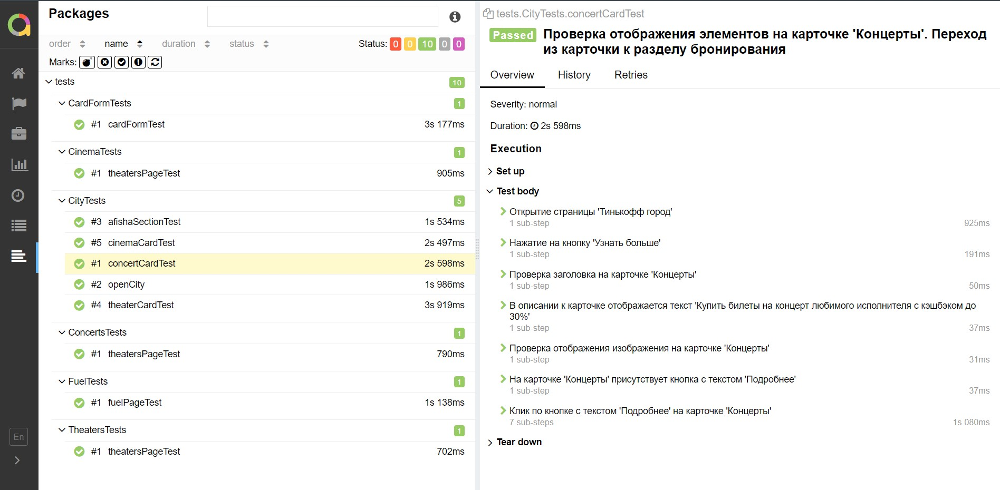

## Учебный проект по автоматизации тестирования (Web UI)
### Веб сайт <a target="_blank" href="https://www.tinkoff.ru/gorod/">Тинькофф Город</a>

<p align="center">

</p>

## :round_pushpin: Содержание:

- Технологии и инструменты
- Список проверок, реализованных в тестах
- Запуск тестов (сборка в Jenkins)
- Allure-отчет
- Интеграция с Allure TestOps
- Интеграция с Atlassian Jira
- Уведомление в Telegram о результатах прогона тестов
- Видео пример прохождения тестов

## :round_pushpin: Технологии и инструменты

<p align="center">
<a href="https://www.jetbrains.com/idea/"></a>
<a href="https://www.java.com/"></a>
<a href="https://github.com/"></a>
<a href="https://junit.org/junit5/"></a>
<a href="https://gradle.org/"></a>
<a href="https://selenide.org/"></a>
<a href="https://aerokube.com/selenoid/"></a>
<a href="https://github.com/allure-framework/allure2"></a>
<a href="https://qameta.io/"></a>
<a href="https://www.atlassian.com/ru/software/jira"></a>
<a href="https://www.jenkins.io/"></a>
</p>

## :round_pushpin:  Список проверок, реализованных в автотестах

- [x] Переход с главной страницы сайта в раздел "Тинькофф город". Проверка наличия элементов на странице.
- [x] Проверка блока афишы на наличие элементов
- [x] Проверка отображения элементов на карточке 'Кино'. Переход из карточки к разделу бронирования
- [x] Проверка отображения элементов на карточке 'Концерты'. Переход из карточки к разделу бронирования
- [x] Проверка отображения элементов на карточке 'Театр'. Переход из карточки к разделу бронирования

## :round_pushpin:  Список проверок, реализованных в ручных тестах

- [x] В разделе 'Тинькофф Город' отображается блок 'Сервис ежедневных покупок'

###  Локальный запуск :
Пример командной строки:
```bash
gradle clean test
```
Получение отчёта:
```bash
allure serve build/allure-results
```

###  :round_pushpin:  Удаленный запуск (в Jenkins):
1. Открыть <a target="_blank" href="https://jenkins.autotests.cloud/job/17-RomanStarkov-project14//">проект</a>


2. Выбрать пункт **Собрать с параметрами**
3. В случае необходимости изменить параметры, выбрав значения из выпадающих списков
4. Нажать **Собрать**
5. Результат запуска сборки можно посмотреть в отчёте Allure


## </a> Отчет в <a target="_blank" href="https://jenkins.autotests.cloud/job/17-RomanStarkov-project14/7/allure/">Allure report</a>


###  Тесты

<p align="center">

</p>

## Интеграция с Allure TestOps


